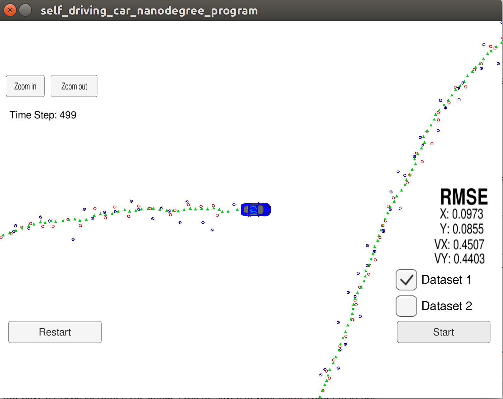
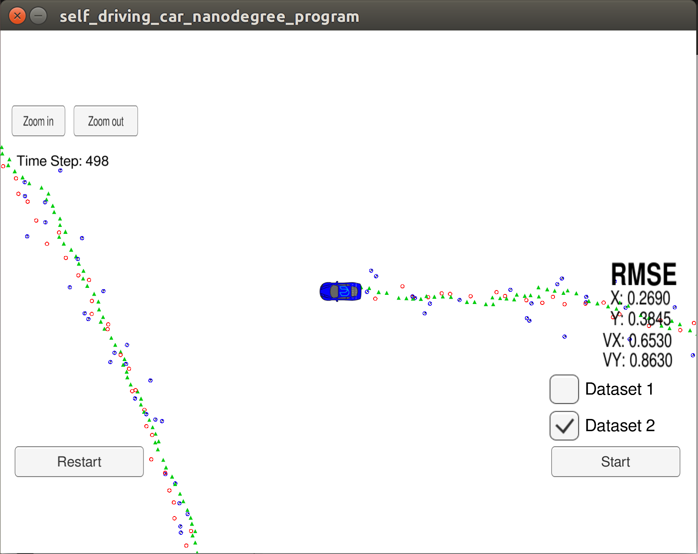
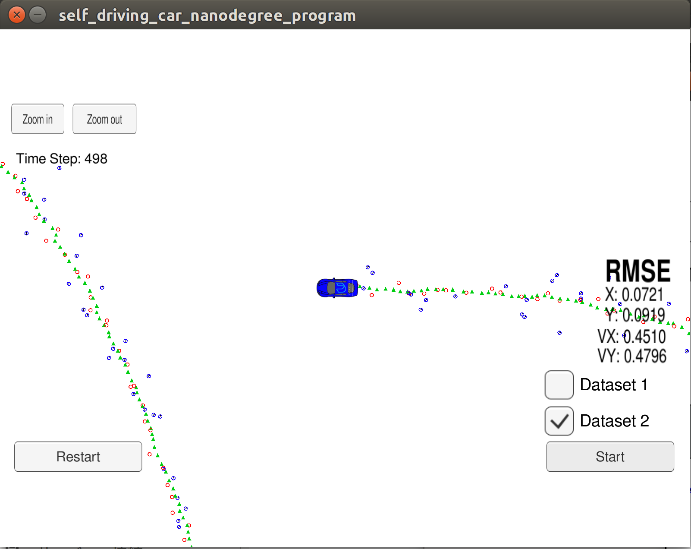

# Project 6: Extended Kalman Filter Project

## 1. Introduction

This project utilizes a kalman filter to estimate the state of a moving object of interest with noisy lidar and radar measurements. 

## 2. Results & Discussion

Below is the sensor fusion general flow by using Extended Kalman Filter (EKF)
<p align="center">
  
</p>
<p align="center">Sensor Fusion general flow<p align="center">

Initial State and x and Covariance Matrix P were setup as following:

<!---
$$x =\begin{pmatrix}
{0.001}\\
{0.001}\\
{0.001}\\
{0.001}
\end{pmatrix}$$ >
-->

<p align="center">

</p>

<!---
$$P =\begin{pmatrix}
1&0&1&0\\
0&1&0&0\\
0&0&1000&0\\
0&0&0&1000
\end{pmatrix}$$
-->

<p align="center">

</p>

The following images show the final RMSE (Root Mean Squared Error ) values of both datasets by combining Lidar and Radar sensors. The smaller RMSE the higher accuracy.

Dataset 1             |  Dataset 2 
:-------------------------:|:-------------------------:
  |    

When turning off one of those sensors, it affects the accuracy so bad.

Without Lidar sensor

Dataset 1             |  Dataset 2 
:-------------------------:|:-------------------------
  |    

Without Radar sensor, 

Dataset 1             |  Dataset 2 
:-------------------------:|:-------------------------:
  |    

Overall, the EKF does a good job for predicting location of tracking objects. Lidar (Laser) measures object location precisely which help improve the location prediction while Radar gives better object's velocity estimation which therefore improve velocity prediction. 

This project did not address when using EKF is how to properly set up the covariance matrixes of process noise Q and measurement noise R. Here, R is often assigned as a constant matrix based on the instrument accuracy of the measurements while Q is assigned as a constant matrix using a trial-and-error approach. 
Below is the matrix Q  including time  to account for the fact that as more time passes, the more uncertain about our position and velocity.  stand for noises  respectively. 

<!---
$$Q =\begin{pmatrix}
{\Delta t^4\over 4}{\sigma_{ax} ^2}&0&{\Delta t^3\over 2}{\sigma_{ax} ^2}&0\\
0&{\Delta t^4\over 4}{\sigma_{ay} ^2}&0&{\Delta t^3\over 2}{\sigma_{ay} ^2}\\
{\Delta t^3\over 2}{\sigma_{ax} ^2}&0&{\Delta t^2}{\sigma_{ax} ^2}&0\\
0&{\Delta t^3\over 2}{\sigma_{ay} ^2}&0&{\Delta t^2}{\sigma_{ay} ^2}
\end{pmatrix}$$
-->
<p align="center">

</p>

Below is the result when tunning noises  from defaul value (9,9) to (6,6) and (12,12)

<p align="center">

</p>

<!--- 
$({noise_{ax} }$, ${noise_{ay} })$ = $(6,6)$
-->
<p align="center">

</p>


Dataset 1             |  Dataset 2 
:-------------------------:|:-------------------------:
  |    

<!---
$({noise_{ax} }$, ${noise_{ay} })$ = $(12,12)$
-->
<p align="center">

</p>

Dataset 1             |  Dataset 2 
:-------------------------:|:-------------------------:
  |    

## 3. Set up environment
This project involves the Term 2 Simulator which can be downloaded [here](https://github.com/udacity/self-driving-car-sim/releases)

This repository includes two files that can be used to set up and install [uWebSocketIO](https://github.com/uWebSockets/uWebSockets) for either Linux or Mac systems. 
For windows you can use either Docker, VMware, or even [Windows 10 Bash on Ubuntu](https://www.howtogeek.com/249966/how-to-install-and-use-the-linux-bash-shell-on-windows-10/) to install uWebSocketIO. 
Please see [this concept in the classroom](https://classroom.udacity.com/nanodegrees/nd013/parts/40f38239-66b6-46ec-ae68-03afd8a601c8/modules/0949fca6-b379-42af-a919-ee50aa304e6a/lessons/f758c44c-5e40-4e01-93b5-1a82aa4e044f/concepts/16cf4a78-4fc7-49e1-8621-3450ca938b77) for the required version and installation scripts.

Once the install for uWebSocketIO is complete, the main program can be built and run by doing the following from the project top directory.
```
1. mkdir build
2. cd build
3. cmake ..
4. make
5. ./ExtendedKF
```

Tips for setting up your environment can be found [here](https://classroom.udacity.com/nanodegrees/nd013/parts/40f38239-66b6-46ec-ae68-03afd8a601c8/modules/0949fca6-b379-42af-a919-ee50aa304e6a/lessons/f758c44c-5e40-4e01-93b5-1a82aa4e044f/concepts/23d376c7-0195-4276-bdf0-e02f1f3c665d)

Note that the programs that need to be written to accomplish the project are src/FusionEKF.cpp, src/FusionEKF.h, kalman_filter.cpp, kalman_filter.h, tools.cpp, and tools.h

The program main.cpp has already been filled out, but feel free to modify it.

Here is the main protcol that main.cpp uses for uWebSocketIO in communicating with the simulator.

INPUT: values provided by the simulator to the c++ program
```C++
//the measurement that the simulator observed (either lidar or radar)
["sensor_measurement"] 
```
OUTPUT: values provided by the c++ program to the simulator
```C++
["estimate_x"] //kalman filter estimated position x
["estimate_y"] // kalman filter estimated position y
["rmse_x"]
["rmse_y"]
["rmse_vx"]
["rmse_vy"]
```

## 4. Other Important Dependencies

* cmake >= 3.5
  * All OSes: [click here for installation instructions](https://cmake.org/install/)
* make >= 4.1 (Linux, Mac), 3.81 (Windows)
  * Linux: make is installed by default on most Linux distros
  * Mac: [install Xcode command line tools to get make](https://developer.apple.com/xcode/features/)
  * Windows: [Click here for installation instructions](http://gnuwin32.sourceforge.net/packages/make.htm)
* gcc/g++ >= 5.4
  * Linux: gcc / g++ is installed by default on most Linux distros
  * Mac: same deal as make - [install Xcode command line tools](https://developer.apple.com/xcode/features/)
  * Windows: recommend using [MinGW](http://www.mingw.org/)

## 5. Basic Build Instructions

	1. Clone this repo.
	2. Make a build directory: `mkdir build && cd build`
	3. Compile: `cmake .. && make` 
	   * On windows, you may need to run: `cmake .. -G "Unix Makefiles" && make`
	4. Run it: `./ExtendedKF `

## 6. Editor Settings

We've purposefully kept editor configuration files out of this repo in order to
keep it as simple and environment agnostic as possible. However, we recommend
using the following settings:

* indent using spaces
* set tab width to 2 spaces (keeps the matrices in source code aligned)

## 7. Code Style

Please (do your best to) stick to [Google's C++ style guide](https://google.github.io/styleguide/cppguide.html).

## 8. Generating Additional Data

This is optional!

If you'd like to generate your own radar and lidar data, see the
[utilities repo](https://github.com/udacity/CarND-Mercedes-SF-Utilities) for
Matlab scripts that can generate additional data.
